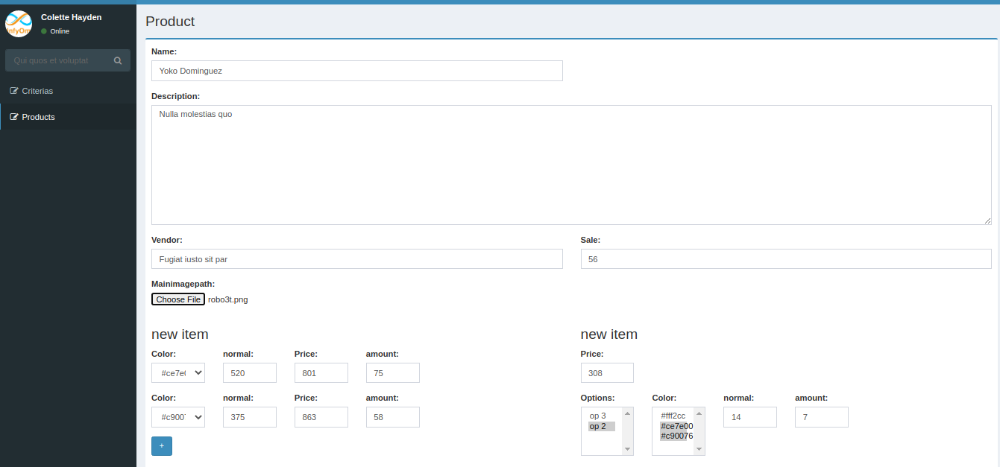
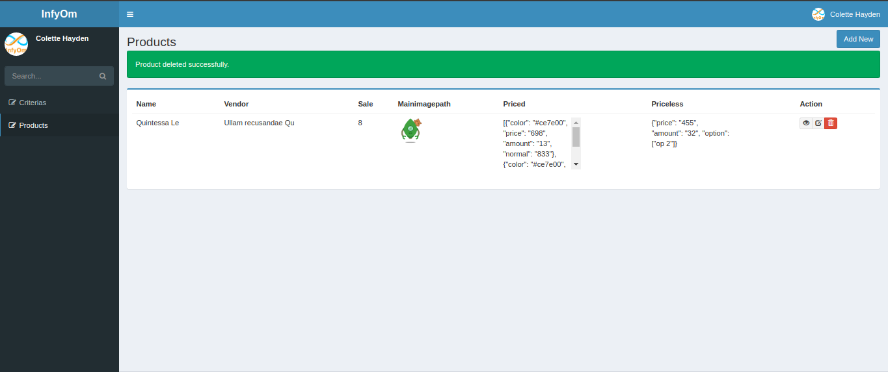
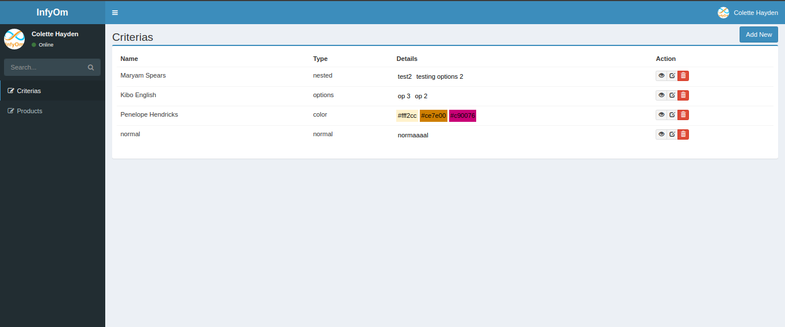
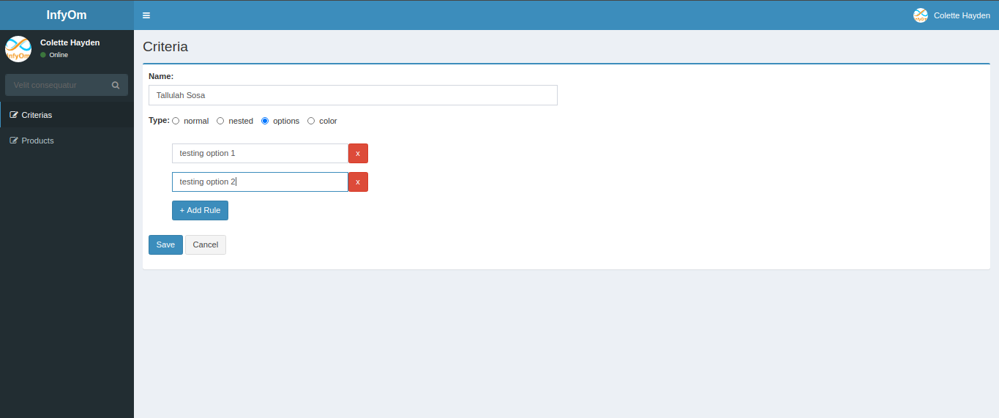

# Product Manager
simple app to manage adding products with specific criteria to ecommerce platform

## Installation

$ git clone https://github.com/Mahmoud-Mohamed-Elgamily/productsManagment.git
$ composer install
$ php artisan storage:link 
$ npm i
$ npm run dev

configure .env file with database credentials then run the following command

$ php artisan migrate

$ php artisan serve

## Workflow
- setting up DataBase
- intializing required models and controllers
- working on views
- manipulating dom for better user experience
- updating database
- connect front and back together

# Pictures

